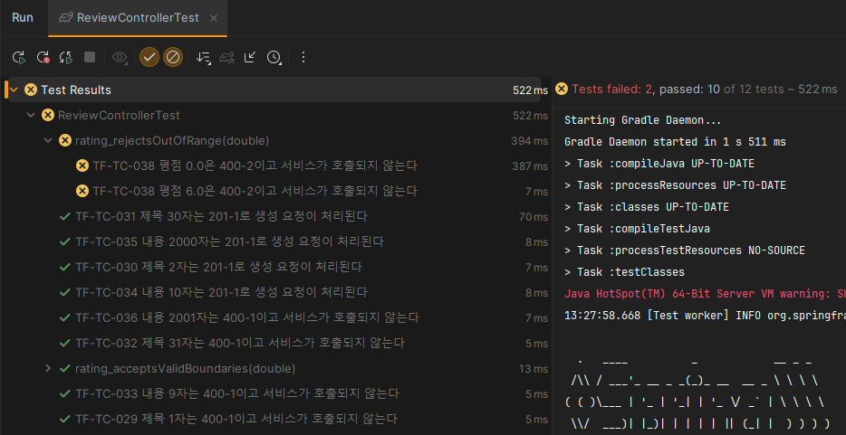
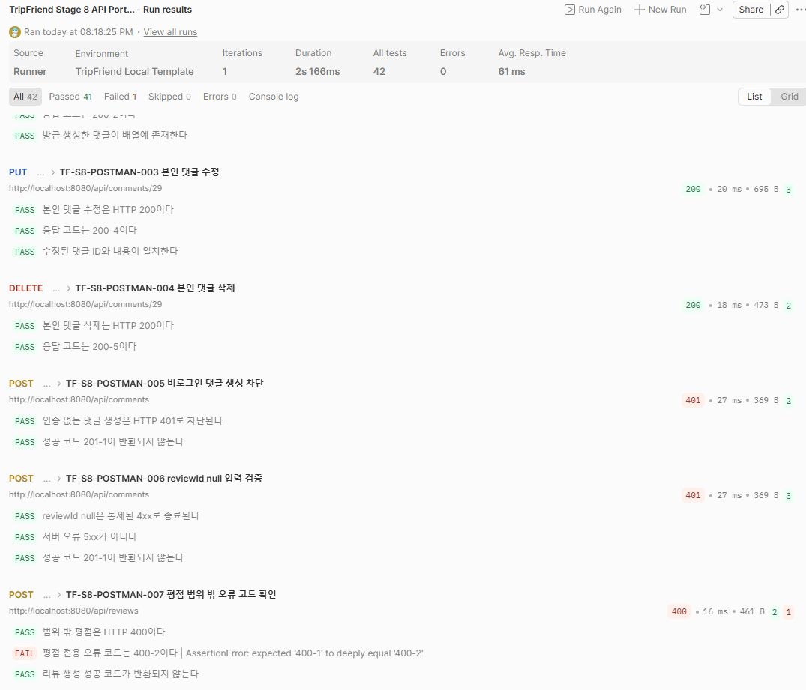
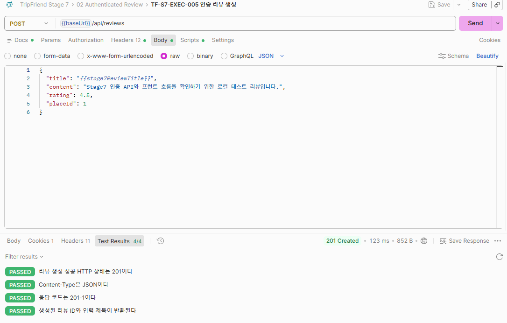
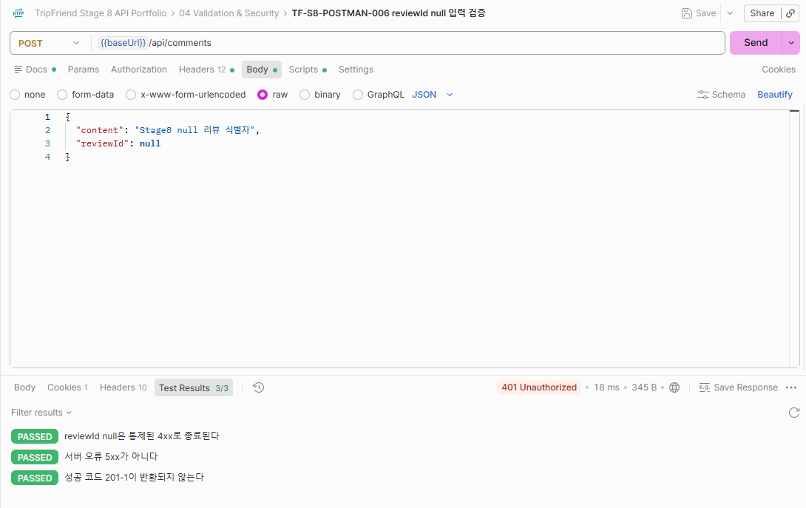
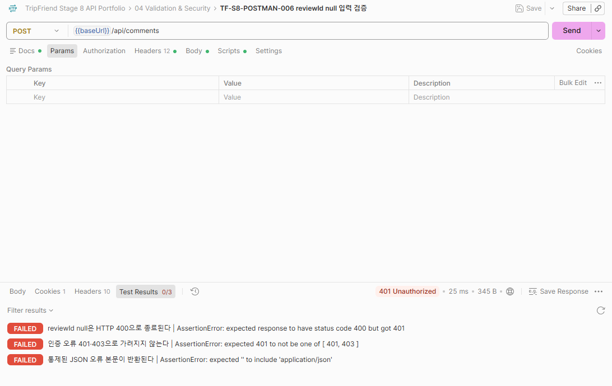

# TripFriend 리뷰·댓글 QA 사례 연구

## 한눈에 보기

TripFriend는 여행지 정보와 사용자 후기·댓글 기능을 제공하는 팀 프로젝트입니다. Java/Spring 완성본의 리뷰·댓글 영역을 주 대상으로 삼아 요구사항 분석, 위험 기반 계획, 계층별 테스트, 실제 API·브라우저 검증, 결함 분석과 회귀 자동화까지 연결했습니다.

| 구분 | 내용 |
|---|---|
| 기준 제품 | `tripfriend-spring` `main` · `e2431223ce2a18c8f944d544cba76b951ce0356d` |
| 주요 테스트 범위 | 리뷰·댓글 CRUD, 인증·권한, 입력 경계, 검색·정렬, API·UI 계약 |
| 환경 | Java 17, Spring Boot 3.2.4, H2, 비저장 Redis, Next.js, Chrome |
| 자동화 | JUnit 5·Mockito·MockMvc·Repository/H2·Spring Security, Postman, Playwright |
| 핵심 테스트 결과 | 49건 판정 완료 · 45 Pass·4 Fail·0 Blocked·0 Not Run |
| 결함·관찰 기록 | 총 15건 · 13 Open · 2 Closed(테스트 구성 오탐) 정책·환경 확인 필요 항목 포함 |

## 역할과 검증 원칙

### 이번 포트폴리오의 QA 활동

- 요구사항과 구현 동작을 비교해 테스트 베이시스와 추적표 작성
- 사용자 영향과 발생 가능성에 따른 위험 기반 우선순위 결정
- 핵심 테스트 49건과 경계값·권한·데이터 격리 전략 설계
- Java/Spring 계층별 테스트와 Postman API 시나리오 구현·실행
- 로컬 환경의 실제 API·브라우저 흐름 검증과 수동 탐색
- Playwright 정상 회귀·등록 결함 재현 자동화와 테스트 데이터 정리
- 실행 결과, 증거, 결함, 재검증 조건의 추적성 관리

### 과거 개발 기여와의 분리

리뷰·댓글 CRUD, 리뷰 목록·평점·조회수·인기글, 담당 화면과 API 연동, Kotlin 리뷰 영역 마이그레이션에 참여했습니다. 회원·JWT·Security·OAuth·여행지 등 팀원 또는 공동 구현 영역은 단독 기여로 주장하지 않습니다.

개발 경험 때문에 구현 의도를 이미 안다는 점이 테스트 편향으로 이어질 수 있다고 판단했습니다. 기억에 의존하지 않고 요구사항·API 계약·실제 응답을 다시 대조했으며, 원본 제품은 보존하고 별도 QA 검증용 사본에서 테스트 구성과 원인 검증용 제품 코드를 구분해 교정했습니다.

## 사용자 영향 사례 — 요청한 여행지가 실제로 변경되는가(TF-BUG-001)

리뷰 수정 시 선택한 여행지로 연결 정보도 바뀌어야 한다는 사용자 관점의 기대 결과를 판정 기준으로 사용했습니다. 수정 요청의 성공만 확인하지 않고 변경 장소가 리뷰에 반영되는지 검증해, 기존 여행지가 유지되는 불일치를 발견했습니다. 사용자가 바꾼 내용이 실제 연결 데이터에 반영되는지를 테스트한 사례입니다.

[여행지 변경 미반영의 기대·실제 결과와 검증 한계](defects/TF-BUG-001-review-place-not-updated.md)

## QA 접근 방식

### 1. 요구사항에서 결함까지 연결

다음 흐름을 공통 식별자로 추적했습니다.

> 요구사항·관찰 → 위험 → 테스트 조건 → 테스트 케이스 → 실행 → 증거 → 결함 → 재검증

예를 들어 리뷰 수정 시 여행지 변경 계약은 `TF-REQ-004 → TF-RISK-001 → TF-COND-003 → TF-TC-008 → TF-EXEC-003·004 → TF-BUG-001`로 연결됩니다. 자연어 설명과 내부 ID를 함께 사용해 결함 보고서에서 기대 결과의 출처와 재현 테스트를 역으로 찾을 수 있게 했습니다.

### 2. 위험 기반 우선순위

- **P0(최우선):** 사용자 영향과 위험도가 높아 가장 먼저 실행한 핵심 CRUD·권한·입력 경계·오류 계약
- **P1(중간 우선순위):** 조합 검색·정렬, 페이지네이션, CORS, 조회수, 오류 표시
- **P2(후순위):** 이미지, 인기 점수, 동시성, 성능, Kotlin 전체 회귀

P0/P1/P2는 결함 심각도가 아니라 테스트 실행 우선순위입니다. 모든 기능을 같은 깊이로 검증하기보다 사용자 흐름과 데이터 무결성에 영향이 크고 반복 확인 비용이 높은 항목을 먼저 선택했습니다.

### 3. 판정 기준

기대 결과와 실제 동작의 일치는 Pass, 유효한 검증 지점의 불일치는 Fail, 환경·데이터·테스트 구성 때문에 판단할 수 없으면 Blocked, 미실행은 Not Run으로 기록했습니다. 컴파일 성공이나 테스트 도구가 표시한 실패 개수만으로 제품 품질을 판단하지 않았습니다.

## 실행 결과와 의미

| 실행 묶음 | 결과 | 해석 |
|---|---|---|
| Java/Spring 핵심 테스트 49건 | **45 Pass·4 Fail** | 리뷰·댓글 Controller 테스트의 구성 오탐을 교정한 케이스별 누적 결과입니다. 이번 교정 실행은 댓글 경계 4개이며 전체 49개 재실행은 아닙니다. |
| 실제 서버 API·브라우저 통합 검증 8건 | **7 Pass·1 Fail** | 실제 localhost API, 인증 리뷰 생성·조회, 브라우저 CORS와 UI 흐름을 판정했습니다. |
| 댓글·입력 중심 API 추가 검증 7건 | **5 Pass·2 Fail** | 정상 댓글 흐름은 통과했고 TF-BUG-003·006을 실제 HTTP 수준에서 다시 확인했습니다. |
| 수동 프런트 탐색 | **관찰 6건 등록** | 전체 실행 시나리오 수가 확인되지 않아 `6 Fail`로 합산하지 않고 관찰 결과와 관련 코드를 함께 확인해 기록했습니다. |
| Playwright 정상 회귀 | **QA 사본 교정 후 5/5 Pass** | CORS·접근성 속성·수정 폼 초기화 교정을 포함한 사본의 기존 결과입니다. 원본 제품 수정 완료가 아닙니다. |
| 등록 결함 재현 자동화 | **3/3 재현** | TF-BUG-010·014를 예상대로 검출했습니다. 자동화 오류가 아니므로 정상 회귀 성공률과 분리했습니다. |

상세 수치와 실행 ID는 [최종 QA 결과와 판단 기준](reports/tripfriend-stage-8-results-summary.md)과 [핵심 백엔드 테스트 실행 보고서](reports/p0-backend-test-execution-report.md)에서 확인할 수 있습니다.

> 리뷰 Controller 테스트 구성 교정 과정의 실행 증거입니다. 12개 변형 중 10개가 통과하고 평점 경계값 2개가 실패했습니다. 이번 댓글 Controller 4/4 교정 결과는 위 교정 보고서에 별도로 기록했습니다.

> Runner는 42개 검증 조건(assertion) 중 41개 통과로 표시됐지만 요청별 실제 응답을 다시 검토해 신규 7건을 5 Pass·2 Fail로 판정했습니다. 화면의 초록색 개수와 QA 판정을 동일시하지 않았습니다.

## 대표 결함과 QA 판단

### 리뷰 수정 폼의 기존 값 미초기화(TF-BUG-015)

**상황과 고민:** 리뷰 수정·삭제 자동화가 필수 입력값 단계에서 반복 중단됐습니다. 제품 문제로 바로 등록할지, 테스트가 비동기 초기화를 충분히 기다리지 못한 것인지 먼저 확인해야 했습니다.

**판단과 검증:** 처음에는 동기화 가능성을 두고 Blocked로 보류했습니다. 기존 제목·내용·여행지·평점을 기다리는 assertion을 추가했지만 제목이 계속 빈 값이었고, Next.js 동적 경로(route) 처리 문제라는 첫 가설을 교정한 뒤에도 같은 실패가 유지됐습니다. 상세 API 응답과 테스트 데이터가 정상인 점을 확인해 수정 폼의 비동기 초기값 반영 문제로 범위를 좁혔습니다.

**결론과 원칙:** 별도 QA 환경에서 데이터 로딩 완료 후 폼을 렌더하도록 교정하자 단일 재검증과 정상 회귀 5건 전체가 통과했습니다. 원본 제품은 수정하지 않았으므로 결함은 Open으로 유지했습니다. 이 경험을 통해 자동화 코드 교정, QA 환경 교정, 제품 수정 완료를 서로 다른 상태로 관리하게 됐습니다.

[상세 결함 보고서](defects/TF-BUG-015-review-edit-form-initial-values-empty.md)

### 제품 결함이 아니었던 테스트 구성 오탐(TF-BUG-002)

**상황과 고민:** 독립형 MockMvc 테스트에서는 리뷰 생성이 HTTP 200으로 보여 제품 결함으로 의심했습니다. 하지만 테스트 실패만으로 제품 결함을 확정해도 되는지 다시 확인했습니다.

**판단과 검증:** 실제 localhost 서버에서 같은 계약을 확인하자 정상적인 HTTP 201을 반환했습니다. 기존 테스트에 실제 응답을 변환하는 `ResponseAspect`가 포함되지 않은 것이 차이였습니다.

**결론과 원칙:** 제품 결함이 아닌 테스트 구성 오탐으로 Closed 처리하고, 실제 구성에 가까운 Controller 중심 Web MVC 테스트로 연결 테스트 5건을 다시 실행해 Pass로 교정했습니다. 이후 테스트 실패를 결함으로 등록하기 전에 실제 제품 동작을 검증한 결과인지를 먼저 확인하는 기준을 세웠습니다.

> 실제 서버의 HTTP 201 응답을 반증 근거로 사용해 기존 실패를 제품 결함이 아닌 테스트 구성 문제로 재분류했습니다.

[상세 결함 보고서](defects/TF-BUG-002-review-create-http-status-200.md)

### 같은 오탐 패턴을 댓글 테스트까지 점검(TF-BUG-004)

리뷰 테스트에서 확인한 오탐 패턴을 댓글 생성 테스트까지 확장 점검한 결과, 실제 `ResponseAspect`가 빠져 있음을 확인했습니다. Web MVC slice에 실제 응답 변환을 포함하자 댓글 1·2·100·101자 4개가 모두 통과했습니다. TF-TC-040·041을 Pass로 정정하고, 제품 결함으로 등록했던 TF-BUG-004를 테스트 구성 오탐으로 Closed했습니다. 기존 실패 이력을 보존하며 누적 결과를 45 Pass·4 Fail로 갱신했습니다.

[교정 실행 결과와 범위](reports/portfolio-review-correction-report.md)

### 제품 오류와 초록색 테스트를 함께 의심한 사례(TF-BUG-006)

**상황과 고민:** 댓글 생성 요청의 `reviewId` 누락·null 문제를 확인하던 중 Postman은 3개 assertion을 모두 통과로 표시했지만 실제 응답은 HTTP 401·빈 본문이었습니다. 초록색 결과를 그대로 신뢰할 수 있는지 검토했습니다.

**판단과 검증:** 넓은 `4xx` assertion이 인증 실패까지 정상처럼 허용한다는 점을 확인했습니다. 인증 토큰 사전조건, 정확한 HTTP 400, 401/403 미발생, JSON 오류 본문을 함께 확인하도록 판정 기준을 좁혔습니다.

**결론과 원칙:** 같은 잘못된 응답을 새 assertion이 모두 실패로 검출했습니다. 제품 입력 검증 문제와 테스트 코드의 거짓 통과를 별도 원인으로 관리했으며, 이후 정상 입력의 Pass뿐 아니라 잘못된 결과를 테스트가 실제로 거부하는지도 확인하게 됐습니다.

| 판정 기준 교정 전 | 판정 기준 교정 후 |
|---|---|
|  |  |
| 실제 응답은 잘못됐지만 넓은 4xx 조건으로 Passed | 상태·인증·본문 조건을 강화해 잘못된 응답을 검출 |

[상세 결함 보고서](defects/TF-BUG-006-comment-review-id-null-request-processing-exception.md)

### API 단독 성공과 브라우저 실패 비교(TF-BUG-007)

같은 공개 조회가 curl·Postman에서는 HTTP 200이지만 Chrome에서는 OPTIONS preflight 403으로 차단됐습니다. CORS 허용 Origin 설정이 두 번째 setter 호출로 덮어써지는 점을 코드와 연결하고, 별도 QA 환경에서 두 Origin을 하나의 목록으로 합친 뒤 Place·Review 200, 리뷰 카드 표시, 정상 빈 검색 결과를 재검증했습니다. QA 환경의 Pass를 원본 제품 수정 완료로 표현하지 않고 결함은 Open으로 유지했습니다.

[상세 결함 보고서](defects/TF-BUG-007-localhost-cors-preflight-blocked.md)

## 자동화 전략

| 도구 | 사용 목적 | 선택 이유와 한계 |
|---|---|---|
| JUnit 5·Mockito | Service 분기와 협력 객체 계약 | 빠른 격리 검증에 사용하며 HTTP·실제 DB 결과로 확장 해석하지 않음 |
| MockMvc | Controller 입력·권한·응답 계약 | 실제 응답 변환 구성의 포함 여부를 명시 |
| Repository/H2 | 정렬·조회·영속성 결과 | 외부 MySQL과 동일하다고 주장하지 않음 |
| Spring Security Test | 인증·비인증·작성자 권한 | 실제 OAuth·운영 인증 흐름은 별도 범위 |
| Postman | 실제 localhost HTTP 시나리오 | 환경 템플릿에는 비밀값을 넣지 않고 assertion의 거짓 통과도 재검증 |
| Playwright | 반복 비용이 높은 핵심 사용자 흐름 | 정상 회귀 5개와 등록 결함 재현 3개를 분리하고 테스트 데이터를 실행 후 정리 |

수동 탐색에서 발견한 모든 항목을 자동화하지 않았습니다. 비즈니스 중요도, 기능 연결성, 반복 비용, 회귀 위험, locator와 합격·실패 기준의 안정성을 바탕으로 선별했습니다.

- [Java/Spring 자동화 안내](automation/README.md)
- [Playwright 자동화 코드와 실행 조건](automation/playwright/)
- [Postman Collection과 환경 템플릿](api/postman/)

## 주요 산출물

| 확인 목적 | 산출물 |
|---|---|
| 댓글 Controller 후속 교정 | [교정 실행 4 Pass와 판정 정정](reports/portfolio-review-correction-report.md) |
| 전체 결과와 판단 경계 | [최종 QA 결과 요약](reports/tripfriend-stage-8-results-summary.md) |
| 테스트 전략과 우선순위 | [리스크 기반 테스트 계획](test-plan/risk-based-test-plan.md) |
| 요구사항 추적 | [요구사항-코드 추적표](test-plan/requirements-code-traceability.md) |
| 핵심 테스트 상세 케이스 | [테스트케이스 49건](test-cases/p0-review-comment-test-cases.md) |
| 백엔드 실행 근거 | [백엔드 테스트 실행 보고서](reports/p0-backend-test-execution-report.md) |
| 실제 API·UI 흐름 | [API·프런트 실행 보고서](reports/api-frontend-flow-execution-report.md) |
| 수동 탐색 | [프런트 탐색 보고서](reports/manual-frontend-exploration-report.md) |
| 결함 전체 기록 | [TF-BUG-001~015](defects/) |
| 자동화 구현 | [Java/Spring](automation/) · [Playwright](automation/playwright/) · [Postman](api/postman/) |
| 대표 실행 증거 | [테스트 실행·재검증 증거](evidence/) |

## 검증 범위의 한계

- 외부 MySQL, OAuth, 메일, 배포 환경, 성능, 동시성, Kotlin 전체 회귀는 실행하지 않았습니다.
- H2·Mock 기반 결과를 운영 환경 전체의 품질로 일반화하지 않습니다.
- 수동 탐색 6건은 전체 실행 시나리오 수가 없어 별도 성공률을 만들지 않았습니다.
- 별도 QA 환경의 교정·Pass는 원본 제품의 수정 완료나 결함 Closed를 의미하지 않습니다.
- 정책이 명시되지 않은 TF-BUG-012와 환경 제한 관찰인 TF-BUG-013은 확정 범위를 제한했습니다.
- 공개 테스트만으로 전체 재현 환경이 자동 구성되지는 않습니다. [재현 조건과 제공 범위](automation/README.md#재현-조건과-공개-범위)를 명시했습니다.
- Playwright 리뷰 삭제는 UI 처리·목록 복귀까지 확인했고 자원 미존재를 별도 assertion하지 않았습니다.

## AI 활용

Codex는 코드 탐색, 테스트·문서 초안 작성과 오류 분석을 보조했습니다. 테스트 범위, 위험 우선순위, 합격·실패 기준과 최종 판정은 작성자가 검토했으며 IntelliJ·Postman·Chrome·Playwright를 통해 대표 실행과 결과를 직접 확인했습니다.

[포트폴리오 첫 화면으로 돌아가기](../../README.md) · [용어와 식별자 안내](../../shared/glossary.md)
